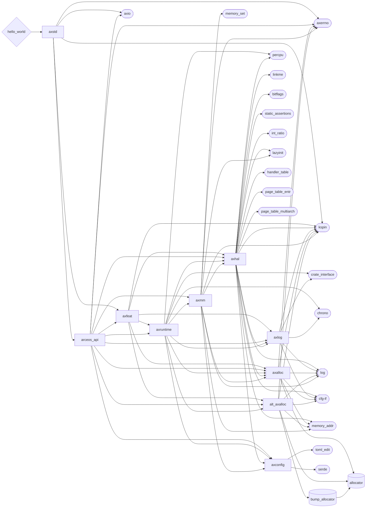

# minOS

WIP: minOS 是基于 [ArceOS](https://github.com/arceos-org/arceos) 的、能输出 `Hello, Arceos!` 的最小子集。

## minOS 依赖关系

以下是 minOS 的各个组件之间的依赖关系：

```mermaid
graph LR
    hello_world{hello_world} --> axstd

    axstd --> axfeat
    axstd --> arceos_api
    axstd --> axio([axio])
    axstd --> axerrno([axerrno])
    axstd --> kspin([kspin])

    axfeat --> axruntime
    axfeat --> axhal
    axfeat --> axlog
    axfeat --> axalloc
    axfeat --> alt_axalloc
    axfeat --> kspin([kspin])

    arceos_api --> axio([axio])
    arceos_api --> axerrno([axerrno])
    arceos_api --> axfeat
    arceos_api --> axruntime
    arceos_api --> axconfig
    arceos_api --> axlog
    arceos_api --> axhal
    arceos_api --> axalloc
    arceos_api --> alt_axalloc
    arceos_api --> axmm

    axruntime --> axhal
    axruntime --> axlog
    axruntime --> axconfig
    axruntime --> axalloc
    axruntime --> alt_axalloc
    axruntime --> axmm
    axruntime --> crate_interface([crate_interface])
    axruntime --> percpu([percpu])
    axruntime --> chrono([chrono])

    axhal --> log([log])
    axhal --> cfg-if([cfg-if])
    axhal --> linkme([linkme])
    axhal --> bitflags([bitflags])
    axhal --> static_assertions([static_assertions])
    axhal --> kspin([kspin])
    axhal --> int_ratio([int_ratio])
    axhal --> lazyinit([lazyinit])
    axhal --> percpu([percpu])
    axhal --> memory_addr([memory_addr])
    axhal --> handler_table([handler_table])
    axhal --> page_table_entr([page_table_entr])
    axhal --> page_table_multiarch([page_table_multiarch])
    axhal --> axlog
    axhal --> axconfig
    axhal --> axalloc

    axlog --> cfg-if([cfg-if])
    axlog --> log([log])
    axlog --> kspin([kspin])
    axlog --> crate_interface([crate_interface])
    axlog --> chrono([chrono])

    axalloc --> log([log])
    axalloc --> cfg-if([cfg-if])
    axalloc --> kspin([kspin])
    axalloc --> memory_addr([memory_addr])
    axalloc --> axerrno([axerrno])
    axalloc --> allocator[(allocator)]

    alt_axalloc --> log([log])
    alt_axalloc --> cfg-if([cfg-if])
    alt_axalloc --> kspin([kspin])
    alt_axalloc --> memory_addr([memory_addr])
    alt_axalloc --> axerrno([axerrno])
    alt_axalloc --> allocator[(allocator)]
    alt_axalloc --> bump_allocator[(bump_allocator)]

    axconfig --> toml_edit([toml_edit])
    axconfig --> serde([serde])

    axmm --> axhal
    axmm --> axconfig
    axmm --> axalloc
    axmm --> log([log])
    axmm --> axerrno([axerrno])
    axmm --> lazyinit([lazyinit])
    axmm --> memory_addr([memory_addr])
    axmm --> memory_set([memory_set])
    axmm --> kspin([kspin])

    bump_allocator --> allocator[(allocator)]
```
