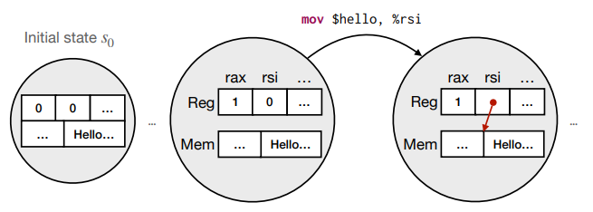
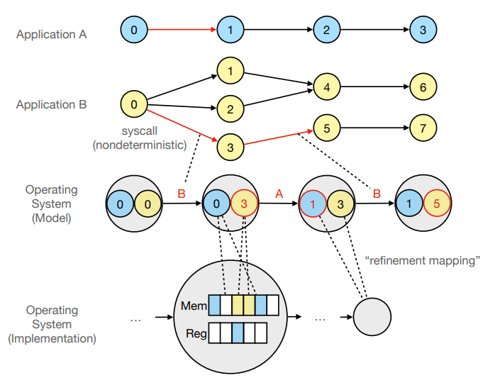
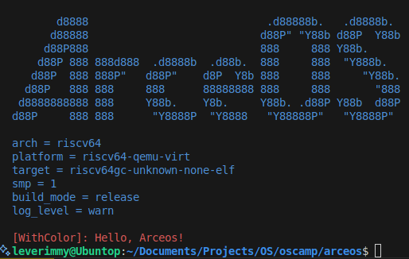

# 2025-04-10 期中汇报

计24 熊泽恩

---

## 基本情况

1. 学习并复现了 Modeled OS 相关工作，并以 [MOSAIC](https://github.com/jiangyy/mosaic) 为例研究了相关代码。
2. 从 Modeled OS 出发，尝试为当前 OS 课程的讲义提出建议，辅助理解。
3. 学习了 Unikernel 相关内容，为后续工作打基础。

---

## MOSAIC: Modeled Operating System And Interactive Checker

MOSAIC 是 ATC23' 的一篇论文 [The Hitchhiker's Guide to Operating Systems](https://www.usenix.org/system/files/atc23-jiang-yanyan.pdf) 的成果。这篇论文的中心思想是：所有的**系统**——只要能被称为“系统”——都可以通过一定的形式化语言进行建模，然后看成一个**状态机**。


高级语言写的程序可以用编译器编译得到汇编语言。对于汇编语言来说，每条指令要么 (a) 对寄存器进行操作，要么 (b) 对内存进行操作。因此，程序对应的状态机可以用一个五元组

$$
A = (S, I, \delta, s_0, F)
$$

---

### 程序是状态机

对于 $S$ 中的状态 $s_i$，我们可以用一个二元组来表示，$s_i = \left<R_i, M_i\right>$，分别对应着寄存器值与内存布局。$I$ 是指令集合，执行一条指令，对应着状态之间的转移函数 $\delta: S \times I \to S$。程序正常退出时会落入集合 $F$ 中的状态。



---

### OS 是状态机的管理者

每个进程的初始状态 $s_0$（包含了 initial memory layout）由 ABI 与该程序的二进制文件唯一决定，其转移函数也由二进制文件确定。从这个角度看，操作系统可视为**一个管理多种状态机的系统**。它记录多个状态机目前都位于什么状态，并且管理何时从这些状态进行转移。



---

OS 作为管理者，为每个进程提供了一定程度的抽象。

例如，OS 使用页表进行虚拟内存的管理，而每个进程对此毫不知情；每当有外部中断发生时，OS 会接管当前状态，处理完后再将控制流转交给进程，此时进程感受不到中断，它们仍然认为控制流是完整的。

再仔细考虑 trap/interrupt handler：在处理中断和异常时，需要保存当前现场；这其实就是在保存一个进程状态机的状态（各种寄存器的值以及当前内存布局），以供控制流转交回进程时能够恢复现场。

---

### Trace 是状态机中的一条路径

如果我们将程序运行的所有状态记录下来，那么它将在状态机（转移图）上构成一条路径。利用这条路径，我们可以方便地对程序进行调试。

$$
\text{tr} : s_0 \to s_1 \to s_2 \to \cdots \to s_n
$$

然而，记录完整轨迹在工程实践中并不现实。原因在于：

1. **数据量过大**：程序每执行一条指令都会导致状态变化，而状态本身可能包含寄存器值和内存布局等大量信息。现代计算机每秒可能执行数十亿条指令，如果完整记录所有状态快照和状态转移，将会占用巨大的存储空间。
2. **大部分状态信息是冗余的**：理解程序执行通常只需要轨迹中的很小一部分信息，而绝大多数状态对特定分析任务无关紧要。

因此，我们可以考虑只记录 $\text{tr}$ 中的一部分。**断点**告诉我们，什么时候需要“记录一个状态”。

---

### Take-home Message

程序就是状态机；状态机可以用程序表示。因此：我们可以用更“简单”的方式 (例如 Python) 描述状态机、建模操作系统上的应用，并且实现操作系统的可执行模型。而一旦把操作系统、应用程序当做 “数学对象” 处理，那么我们图论、数理逻辑中的工具就能被应用于处理程序，甚至可以用图遍历的方法证明程序的正确性。

> 注：论文的[学习笔记](https://leverimmy.top/2025/03/16/Paper-Reading-The-Hitchhiker-s-Guide-to-Operating-Systems/)，和 [MOSAIC 的代码分析](https://github.com/leverimmy/mosaic/blob/main/CODE_ANALYSIS.md)。

---

### 为 OS 课程教学带来的启示

---

例 1：`fork.py`

```python
def main():
    pid = sys_fork()
    if pid != 0:
        sys_sched()
    sys_write(f'fork() returned {pid}\n')

    if pid == 0:
        sys_write('child\n')
    else:
        sys_write('parent\n')
```

期望得到的结果是，要么输出 `fork() returned 0\nchild\nfork() returned 1002\nparent`，要么输出 `fork() returned 1002\nparent\nfork() returned 0\nchild`。

---

例 2：`fork-exec.py`

```python
def echo(args):
    sys_write(' '.join(args[1:]))

def main():
    pid = sys_fork()
    if pid != 0:
        sys_sched()
    if pid == 0:
        sys_exec(echo, ['echo', 'this', 'is', 'echo'])
        sys_write('Why would I execute?\n')
    else:
        sys_write("Who's your daddy?\n")
```

期望得到的结果是，永远不会输出 `Why would I execute?`，这是因为在 `sys_exec` 之后，不会再返回。

---

例 3：`mutex-1.py`

```python
N = 2

def Worker():
    if heap.tot == 0:
        if heap.note == 0:
            sys_sched()
            heap.note = 1
            heap.tot += 1
            heap.note = 0
    heap.finished += 1

def main():
    heap.finished = 0
    heap.tot = 0
    heap.note = 0
    for _ in range(N):
        sys_spawn(Worker)
    while heap.finished < N:
        sys_sched()
    sys_write(f'Bought {heap.tot} bread.')
```

---

期望得到的输出：`Bought 1 bread.` 和 `Bought 2 bread.` 都有可能。

---

例 4：`mutex-5.py`

```python
N = 4

def aqcuire():
    while heap.lock != 0:
        sys_sched()
    heap.lock = 1

def release():
    heap.lock = 0

def Worker():
    aqcuire()
    sys_sched()
    if heap.tot == 0:
        heap.tot += 1
    sys_sched()
    release()
    heap.finished += 1

def main():
    heap.finished = 0
    heap.tot = 0
    heap.lock = 0
    for i in range(N):
        sys_spawn(Worker)
    while heap.finished < N:
        sys_sched()
    sys_write(f'Bought {heap.tot} bread.')
```

---

期望得到的输出：`Bought 1 bread.`。

---

### 成果

1. 改进了 MOSAIC，添加了 `sys_exec()` 等系统调用，并提交到了[自己的仓库中](https://github.com/leverimmy/mosaic)。
2. 设计了关于 `fork()`、`exec()` 以及锁相关的[示例](https://github.com/leverimmy/mosaic/tree/main/tutorials)，并验证了结果的正确性。
3. 修改并补充了第 1 讲、第 7 讲、第 12 讲的内容，并提交到了[自己的仓库中](https://github.com/leverimmy/os-lectures)。

---

## Unikernel 相关内容的学习

完成了 [`print_with_color`](https://github.com/leverimmy/oscamp/tree/print_with_color) 的练习。



---

### ArceOS 的框架

引导部分（由下至上）：

$$
\text{axhal} \to \text{axruntime} \to \text{app}
$$

运行阶段（由上至下）：

$$
\text{app} \to \text{ulib}(\text{axstd} \to \text{arceos\_api}) \to \text{axruntime} \to \text{axhal}
$$

---

## 后续计划

1. 完成 Unikerel 和宏内核的视频学习，完成 [OSCamp](https://opencamp.cn/os2edu/camp/2025spring/stage/3?tab=video) 中的练习。
2. 分析出组件库中最没有依赖性的模块是什么。尝试从这些组件中，找出最小的集合，使得 OS 能够输出 `Hello, world!`。
3. 学习 Verus，并尝试用 Verus 去验证这个 OS 的正确性。

---

# 谢谢大家！
