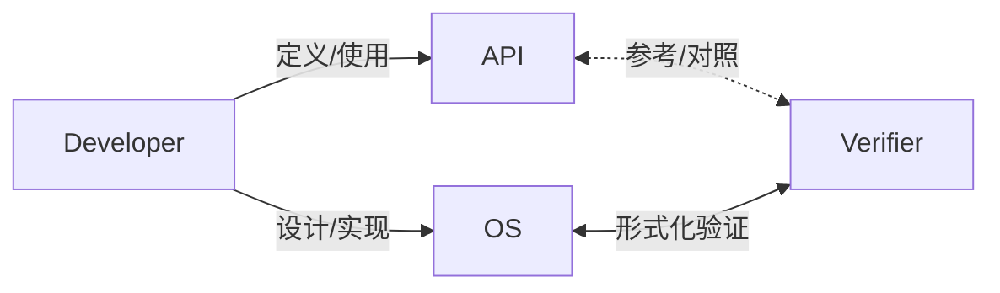

# OS 大实验结题汇报

<br /><br /><br />

计 24 熊泽恩

2025 年 6 月 5 日

---
transition: fade-out
---

## 主要工作

在期中后的八周里，我的主要工作为：

1. 了解了 OS 形式化验证的相关工作。
   - 学习了 Kani 工具的使用，写了一篇[学习笔记](https://leverimmy.top/2025/04/22/An-Introduction-to-Kani/)。
   - 练习：使用 Kani 编写了 [bubble-sort](https://github.com/LearningOS/osbiglab-2025s-2022011223/tree/main/kani-exercises/bubble_sort) 的证明。
2. 使用 Kani 验证了 `memory_addr` 这个 crate 的正确性。
   - 验证的性质包括：
      - 核心地址类型（`MemoryAddr`）的对齐和算术运算。
      - 地址范围（`AddrRange`）的构造和操作的正确性。
      - 页迭代器（`PageIter`）的迭代逻辑和边界条件。
3. 使用 Kani 复现了 [eternalcomet 组](https://github.com/leverimmy/undefined-os-final) 和 [Mivik 组](https://github.com/leverimmy/starry-next-mivik) 的 OS 中的 bug。

---
transition: fade-out
---

## Kani 简介 (1/3)

**Kani 是什么？**

- Kani 是一款针对 Rust 代码的**形式化验证工具**。
- 它旨在**数学上证明**你的 Rust 代码在特定条件下满足某些性质，或者找到违反这些性质的反例。
- 与传统测试（如单元测试）不同：
   - 单元测试：检查代码对*部分特定输入*的行为。
   - Kani：尝试检查代码对（在给定约束内）*所有可能输入*的行为。
- 底层依赖于**有界模型检查** (Bounded Model Checking) 技术，通常使用 CBMC 作为后端。

**核心思想**

1. **不确定性输入**: 使用 `kani::any::<T>()` 来代表任意可能的输入值。
2. **前提条件**: 使用 `kani::assume(condition)` 来约束输入的范围，只关注我们关心的场景。
3. **断言**: 使用 `kani::assert(property)` 来声明代码执行后必须满足的条件。

Kani 会自动探索在 `assume` 条件下，所有可能的 `any` 输入组合，检查 `assert` 是否始终成立。

---
transition: fade-out
---

## Kani 简介 (2/3)

**关键特性与概念**

- **Proof Harnesses (`#[kani::proof]`)**
   - 标记的函数，作为 Kani 验证的入口点。
- **循环展开 (Loop Unwinding)**:
   - 循环是验证的难点。Kani 将循环“展开”固定次数进行分析。
   - 需要通过 `#[kani::unwind(N)]` 或 `--default-unwind N` 指定展开上界。
   - 上界 $N$ 必须足够覆盖预期的最大迭代次数，通常是 `最大迭代次数 + 1`。
- **生成反例 (`--concrete-playback`)**:
   - 如果 Kani 发现 `assert` 可能失败，它能生成一个具体的输入值组合，复现这个 `assert` 失败的情况。

---
transition: fade-out
---

## Kani 简介 (3/3)

使用 `#[kani::requires]`（前置条件）和 `#[kani::ensures]`（后置条件）来对函数进行模块化验证。

```rust
#[kani::requires(x >= 0.0)] // 前置条件：x 必须是非负数
#[kani::ensures(|result| result * result - x <= 1e-6 || x - result * result <= 1e-6)] // 后置条件：结果的平方约等于 x
fn checked_sqrt(x: f64) -> f64 {
    return x.sqrt(); // 计算平方根并转换为整数
}

#[kani::proof_for_contract(checked_sqrt)]
fn prove_sqrt_contract() {
    let val: f64 = kani::any();
    kani::assume(val >= 0.0 && val < 5.0); // 假设输入在合理范围内
    // Kani 在验证 checked_sqrt 时会利用其 requires 和 ensures
    // 如果 checked_sqrt 的实现满足其 contract ，这里就可以基于 contract 进行推理
    let result = checked_sqrt(val);
}

#[kani::proof]
#[kani::stub_verified(checked_sqrt)] // 会将函数中调用的 checked_sqrt 都用已验证的代替
fn a_function_that_calls_checked_sqrt() { }
```

---
transition: fade-out
---

## Kani 怎么用 (1/3)

假设有一份错误的代码：

```rust
fn wrong_bubble_sort(arr: &mut [u32], n: usize) {
    for i in 0..n {
        for j in i..n - i - 1 { // This is WRONG
            if arr[j] > arr[j + 1] {
                arr.swap(j, j + 1);
            }
        }
    }
}
```

正确代码为：

```rust
fn real_bubble_sort(arr: &mut [u32], n: usize) {
    for i in 0..n {
        for j in 0..n - i - 1 {
            if arr[j] > arr[j + 1] {
                arr.swap(j, j + 1);
            }
        }
    }
}
```

---
transition: fade-out
---

## Kani 怎么用 (2/3)

编写 `proof`：

```rust
#[cfg(kani)]
#[kani::proof]
#[kani::unwind(6)] // 至少要比循环次数多 1
fn check_bubble_sort() {
    const LIMIT: usize = 5;

    let mut arr: [u32; LIMIT] = kani::any();
    let length = kani::any();
    kani::assume(length <= LIMIT);

    // real_bubble_sort(&mut arr, length);
    wrong_bubble_sort(&mut arr, length);

    for i in 1..length {
        kani::assert(arr[i - 1] <= arr[i], "Array is not sorted");
    }
}
```

运行 `cargo kani -Z concrete-playback --concrete-playback=print`

--- 
transition: fade-out
---

## Kani 怎么用 (3/3)

得到结果：

```rust
#[test]
fn kani_concrete_playback_check_bubble_sort_5154057050572272088() {
    let concrete_vals: Vec<Vec<u8>> = vec![
        // 3203982223
        vec![143, 227, 248, 190],
        // 2679694234
        vec![154, 227, 184, 159],
        // 2130240398
        vec![142, 227, 248, 126],
        // 3085210182
        vec![70, 146, 228, 183],
        // 937726534
        vec![70, 146, 228, 55],
        // 3ul
        vec![3, 0, 0, 0, 0, 0, 0, 0],
    ];
    kani::concrete_playback_run(concrete_vals, check_bubble_sort);
}
```

给出反例：`arr = [3203982223, 2679694234, 2130240398, 3085210182, 937726534]; length = 3;`

---
transition: fade-out
---

## Kani 适合什么

Kani 在以下场景中特别有用：

- **验证核心算法的正确性**:
   - 例如：排序算法、数据结构操作。
   - 可以证明算法对于所有（有界范围内的）输入都满足其规约。
- **验证模块/库的接口协定 (API Contracts)**:
   - 使用 `#[kani::requires]`（前置条件）和 `#[kani::ensures]`（后置条件）来形式化定义和验证函数行为。
   - 确保函数在满足前置条件时，总能产生满足后置条件的结果。
- **发现边界条件**:
   - Kani 的系统性探索能力比手动编写测试用例更容易发现被忽略的边界情况或由特定输入组合触发的 bug。
   - 例如，整数溢出、数组越界访问（如果未被 Rust 的编译期或运行时检查完全覆盖）。

---
transition: fade-out
---

## Kani 不适合什么

尽管 Kani 很强大，但它并非万能钥匙，也有其不适用的场景和局限性：

- **并发代码**:
   - Kani 目前不支持验证涉及多线程、`async/await` 等并发机制的代码。
- **非常大规模的程序或非常复杂的性质**:
   - 模型检查的计算成本可能很高。
   - 底层 SMT/SAT 求解器本身处理的问题是 NP-Complete 的。
- **需要大量外部交互或依赖**:
   - Kani 难以直接验证与外部系统（文件、网络、硬件设备）的复杂交互。
   - 通常需要对这些外部依赖进行抽象或 Mock。

---
transition: fade-out
---

## Kani 在 OS 领域的应用

针对刚刚的问题，Kani 在 OS 领域有什么应用呢？

1. Kani 无法验证非常大规模的程序
   - 将 OS 组件化之后，规模减小，我们可以从小规模的组件入手开始验证
2. Kani 无法验证对其他代码有大量依赖的程序
   - （暂时缓解）使用 Mock/Stub 的方法，来模拟依赖库的行为。
   - （彻底解决）在未经验证的代码中使用 `kani::assume()` 假设满足一些条件，再逐步验证。

**我将从两个方向具体展开讨论：**

1. 使用 Kani 验证 crate
2. 使用 Kani 验证 OS Kernel

---
transition: fade-out
---

## `memory_addr` 的验证 (1/3)

对 `memory_addr` crate ([leverimmy/verified-memory-addr](https://github.com/leverimmy/verified-memory-addr/)) 的核心功能使用 Kani 进行了形式化验证。主要验证内容包括：

- **`MemoryAddr` Trait 及其实现**：
    - 核心的地址抽象（物理/虚拟地址）。
    - 地址对齐工具方法（如 `align_down`、`align_up`、`is_aligned`）。
    - 地址算术运算（如 `offset`、`add`、`sub`）。
- **`AddrRange` 结构**：
    - 地址范围的构造（检查和非检查版本）。
    - 空范围判断、大小计算、地址/范围包含及重叠判断。
- **`PageIter` 结构**：
    - 逐页迭代器，支持编译期指定页大小。
    - 验证了迭代逻辑、对无效页大小（非 2 的幂或 0）的处理、以及未对齐的起止地址处理。

**成果**：通过 Kani 验证了 `memory_addr` crate 中的全部 55 个 Proof Harnesses，确保了其核心功能的正确性。

---
layout: two-cols-header
transition: fade-out
---

## `memory_addr` 的验证 (2/3) - 示例 1：`align_down`

::left::

**原始函数 (`lib.rs`)**

```rust
pub const fn align_down(
    addr: usize,
    align: usize
) -> usize {
    addr & !(align - 1)
}
```

::right::

**Kani Proof Harness**

```rust
#[kani::proof]
fn proof_align_down() {
    let addr: usize = kani::any();
    let align: usize = kani::any();
    // 前提：align 是有效的（正数且是 2 的幂）
    kani::assume(align > 0 && align.is_power_of_two());
    let result = crate::align_down(addr, align);

    // 验证性质：
    // 1. 结果必须是对齐的
    kani::assert(crate::is_aligned(result, align), "result is not aligned");
    // 2. 结果必须 <= 原始地址
    kani::assert(result <= addr, "result is greater than original");
    // 3. 结果是 <= addr 的最大对齐地址
    //    (addr - result) < align
    kani::assert(addr.wrapping_sub(result) < align,
            "result not largest aligned address <= addr");
    // 4. 如果 addr 已对齐，则结果不变
    if crate::is_aligned(addr, align) {
        assert_eq!(result, addr, "already aligned address changed");
    }
}
```

---
layout: two-cols-header
transition: fade-out
---

## `memory_addr` 的验证 (3/3) - 示例 2：`AddrRange::new`

::left::

**原始函数 (`range.rs`)**

```rust
impl<A> AddrRange<A> where A: MemoryAddr {
    #[inline]
    pub fn new(start: A, end: A) -> Self {
        assert!( // 如果 start > end, 则 panic
            start <= end,
            "invalid `AddrRange`: {}..{}",
            start.into(), end.into()
        );
        Self { start, end }
    }
}
```

::right::

**Kani Proof Harnesses**

```rust
#[kani::proof]
fn proof_new_valid_range() { // 验证合法输入
    let start: usize = kani::any();
    let end: usize = kani::any();
    kani::assume(start <= end); // 前提：start <= end

    let range = AddrRange::<usize>::new(start, end); // 使用 usize 进行具体化
    assert_eq!(range.start, start);
    assert_eq!(range.end, end);
}

#[kani::proof]
#[kani::should_panic] // 期望 panic
fn proof_new_panic_on_invalid_range() { // 验证非法输入
    let start: usize = kani::any();
    let end: usize = kani::any();
    kani::assume(start > end); // 前提：start > end (应触发 panic)
    let _ = AddrRange::<usize>::new(start, end);
}
```

---
transition: fade-out
---

## eternalcomet 组的 Bug (1/6)

我对 `sys_execve` 系统调用在 [Commit 4f2ceae](https://github.com/eternalcomet/undefined-os-final/commit/4f2ceaec3abc147ee764b3f6d6e82315a0932236) 前后的两个版本间的内存安全行为进行了排查和验证。Commit message 如下：

> feat(execve): fix memory leakage on sys_execve
>
> previously, temp variables in sys_execve will not be dropped

我搭建了一个 Kani 测试环境来进行排查：

- **依赖项处理**：对 `sys_execve` 的部分外部依赖（如 `AxError` 定义、`mm::load_user_app` 模块、`axhal` 底层调用等）进行了 Stubbing，来隔离被测函数的逻辑。
- **监控资源释放情况**：在 `MockProcessData` 中引入一个 `MonitoredResource`，在其 `Drop` 实现中会修改一个全局 `AtomicBool` 标志 (`RESOURCE_DROPPED`)，这使得我们能够显式观察数据是否按预期被释放。

---
transition: fade-out
---

## eternalcomet 组的 Bug (2/6)

**修复前版本：**

```rust
pub fn sys_execve_impl_buggy_structure(
    path: String,
    args: Vec<String>,
    envs: Vec<String>
) -> LinuxResult<isize> {
    let uctx = {
        // ...
        let process_data = current_process_data(); // process_data: Arc<ProcessData>
        // ...
        // new user context
        UspaceContext::new(entry_point.as_usize(), user_stack_base, 0)
    };

    // TODO: memory leak
    // we **must** drop all the code before we enter the user space
    unsafe {
        uctx.enter_uspace(current().kernel_stack_top().expect("No kernel stack top"));
    }
}
```

---
transition: fade-out
---

## eternalcomet 组的 Bug (3/6)

**验证的属性与观察结果**

关注的核心属性是 `sys_execve` 执行过程中 `ProcessData` 里的资源是否按照 `Drop` 正确释放。

1. 针对修复前版本：
   - 在此版本中，`ProcessData`（通过 `current_process_data()` 获取，并在其内部包含 `MonitoredResource`），原来的代码中，`current_process_data()` 返回的是一个 `Arc<T>` 的 `.clone()`，因此引用计数会 +1。
   - 然而，该函数随后调用 `uctx.enter_uspace()`，这是一个 `-> !` 的函数。这个调用会导致 `process_data` 将不会由该栈帧的常规 RAII 机制来执行 `Drop`。它的引用计数不会正常 -1，导致它不会被正常释放。
   - Kani 捕获了这一执行路径：在 `MonitoredResource` 被 `Drop` 后，`enter_uspace` 被调用，并按设计触发了 `verify_execve_leak_in_code` 中的 `panic`。Kani 证明了，代码一定会执行到这个 `panic`。

---
transition: fade-out
---

## eternalcomet 组的 Bug (4/6)

**修复后版本：**

```rust
pub fn sys_execve_impl_fixed_returns_ok_structure(
    tf: &mut TrapFrame,
    path: String,
    args: Vec<String>,
    envs: Vec<String>,
) -> LinuxResult<isize> {
    // ...
    let process_data = current_process_data();
    // ...
    // new user context
    tf.set_ip(entry_point.as_usize());
    tf.set_sp(user_stack_base.as_usize());

    Ok(0)
}
```

---
transition: fade-out
---

## eternalcomet 组的 Bug (5/6)

**验证的属性与观察结果**

2. 针对修复后版本：
   - 此版本**不再调用 `enter_uspace`**，而是通过修改 `TrapFrame` 并**正常返回 `Ok(0)`** 来完成执行。
   - 由于函数正常返回，所有局部作用域内遵循 RAII 原则的变量都会被正确 `Drop`。
   - Kani 测试 `verify_no_leak_in_fixed_returns_ok_version` 在函数返回后显式断言 `RESOURCE_DROPPED` 标志为 `true`。程序通过了这个 assertion，证明 `MonitoredResource` 在此版本中得到了正确的释放，从而验证了内存泄漏的修复。

通过这两组 Kani 测试，我们成功地形式化地展示了 `sys_execve` 从一个存在潜在资源释放不完整的状态，到一个能够确保所有局部资源正确清理的更安全状态。

---
layout: two-cols-header
transition: fade-out
---

## eternalcomet 组的 Bug (6/6)

::left::

```rust
// Harness 1: 错误实现：期望导致 panic
#[kani::proof]
#[kani::should_panic]
fn verify_execve_leak_in_code() {
    let path_dummy = String::from("test_app_buggy");
    let args_dummy = Vec::new();
    let envs_dummy = Vec::new();
    {
        let mut proc_guard = MOCK_PROCESS_SINGLETON.lock();
        proc_guard.threads.clear();
        proc_guard.threads.push(0); // Simulate one thread
    }
    let _ = sys_execve_impl_buggy_structure(
        path_dummy,
        args_dummy,
        envs_dummy); // 期望这一句会导致 panic
}
```

::right::

```rust
// Harness 2: 修复后的实现：期望正常退出
#[kani::proof]
fn verify_no_leak_in_fixed_returns_ok_version() {
    let mut tf_dummy = TrapFrame{ ..Default::default() };
    let path_dummy = String::from("test_app_fixed");
    let args_dummy = Vec::new();
    let envs_dummy = Vec::new();
    {
        let mut proc_guard = MOCK_PROCESS_SINGLETON.lock();
        proc_guard.threads.clear();
        proc_guard.threads.push(0);
    }
    let _ = sys_execve_impl_fixed_returns_ok_structure(
        &mut tf_dummy,
        path_dummy,
        args_dummy,
        envs_dummy);
    kani::assert(RESOURCE_DROPPED.load(Ordering::SeqCst));
}
```

---
transition: fade-out
---

## Mivik 组的 Bug (1/8)

对 `sys_utimensat` 系统调用在 [Commit a6d51ff](https://github.com/Mivik/starry-next/commit/a6d51ff5b68660aaac9dd57a765acf8a2fb663fd/) 前后的两个版本间的对 `UTIME_NOW` 和 `UTIME_OMIT` 的行为进行了排查。Commit message 如下：

> fix(fs): utime & utimesnat behavior

原来的 `sys_utimensat` 实现如下：

```rust
pub fn sys_utimensat(
    dirfd: i32,
    path: UserConstPtr<c_char>,
    times: UserConstPtr<timespec>,
    flags: u32,
) -> LinuxResult<isize> {
    let times = nullable!(times.get_as_slice(2))?;
    let atime = times.map(|it| it[0].to_time_value());
    let mtime = times.map(|it| it[1].to_time_value());
    update_times(dirfd, path, atime, mtime, flags)?;
    Ok(0)
}
```

这个实现没有正确处理 `timespec` 中 `tv_nsec` 字段的特殊值 `UTIME_NOW` 和 `UTIME_OMIT`。这些值会被当作普通的纳秒值来转换，导致时间戳设置不正确。

---
transition: fade-out
---

## Mivik 组的 Bug (2/8)

修改后的 `sys_utimensat` 实现如下：

```rust
pub fn sys_utimensat(dirfd: i32, path: UserConstPtr<c_char>,
    times: UserConstPtr<timespec>, mut flags: u32) -> LinuxResult<isize> {
    if path.is_null() {
        flags |= AT_EMPTY_PATH;
    }
    fn utime_to_duration(time: &timespec) -> Option<Duration> {
        match time.tv_nsec {
            val if val == UTIME_OMIT as _ => None,
            val if val == UTIME_NOW as _ => Some(wall_time()),
            _ => Some(time.to_time_value()),
        }
    }
    let times = times.get_as_slice(2)?;
    let atime = utime_to_duration(&times[0]);
    let mtime = utime_to_duration(&times[1]);
    if atime.is_none() && mtime.is_none() {
        return Ok(0);
    }
    update_times(dirfd, path, atime, mtime, flags)?;
    Ok(0)
}
```

---
transition: fade-out
---

## Mivik 组的 Bug (3/8)

修改后的实现引入了一个新的内部函数 `utime_to_duration`，这个函数会检查 `tv_nsec`：

- 如果等于 `UTIME_OMIT`，则返回 `None`，表示不应更改该时间戳。
- 如果等于 `UTIME_NOW`，则返回 `Some(wall_time())`，表示应将该时间戳设置为当前时间。
- 否则，正常转换时间值为 `Duration`。

如果 `atime` 和 `mtime` 在处理后都为 `None`（例如，两个时间戳都指定了 `UTIME_OMIT`），则函数会直接返回 `Ok(0)`，不执行任何更新操作，这是正确的行为。

---
transition: fade-out
---

## Mivik 组的 Bug (4/8)

**验证的属性与观察结果**

我们关注的核心属性是 `sys_utimensat` 函数在接收到包含特殊标志 `UTIME_NOW`（立即更新时间为当前时间）和 `UTIME_OMIT`（不改变时间）的 `timespec` 参数时，是否能够正确地更新或保持文件的访问时间（`atime`）和修改时间（`mtime`）。

为了验证这一点，我搭建了一个 Kani 测试环境：

- 由于 Kani 没有办法使用 `wall_time()`，因为每次调用 `wall_time()` 返回的值都可能不同，它完全取决于程序运行时的外部环境（即真实时间），所以我用 `MOCK_WALL_TIME_DURATION` 这一常量代替。
- 我设置了一个全局变量 `KANI_GLOBAL_MOCK_METADATA` 来记录 `atime` 和 `mtime`。

---
transition: fade-out
---

## Mivik 组的 Bug (5/8)

```rust
#[kani::proof]
fn check_sys_utimensat() {
    let dirfd = 0;
    let path = "test_path";
    // 设置 update_time 的参数值
    let ts_atime_spec = timespec { tv_sec: kani::any(), tv_nsec: kani::any() };
    let ts_mtime_spec = timespec { tv_sec: kani::any(), tv_nsec: kani::any() };
    // assume 它们是有效的
    if ts_atime_spec.tv_nsec != UTIME_NOW as _ && ts_atime_spec.tv_nsec != UTIME_OMIT as _ {
        kani::assume(ts_atime_spec.tv_sec >= 0);
        kani::assume(ts_atime_spec.tv_nsec >= 0 && ts_atime_spec.tv_nsec < 1_000_000_000);
    }
    if ts_mtime_spec.tv_nsec != UTIME_NOW as _ && ts_mtime_spec.tv_nsec != UTIME_OMIT as _ {
        kani::assume(ts_mtime_spec.tv_sec >= 0);
        kani::assume(ts_mtime_spec.tv_nsec >= 0 && ts_mtime_spec.tv_nsec < 1_000_000_000);
    }
    let times_input = Some([ts_atime_spec, ts_mtime_spec]);
    let flags = 0;
    // 初始化全局变量 KANI_GLOBAL_MOCK_METADATA
    let initial_atime_val: Duration = kani::any();
    let initial_mtime_val: Duration = kani::any();
    let initial_metadata_state = MockMetadata { atime: initial_atime_val, mtime: initial_mtime_val };
    unsafe { KANI_GLOBAL_MOCK_METADATA = initial_metadata_state; }
```

---
transition: fade-out
---

## Mivik 组的 Bug (6/8)

```rust
    // ...
    // 记录调用 mock_sys_utimensat 前的 metadata
    let original_meta_data = initial_metadata_state;
    let result = mock_sys_utimensat_buggy(dirfd, path, times_input, flags);
    kani::assert(result.is_ok(), "mock_sys_utimensat_buggy should always return Ok");

    // 读取调用后的 metadata
    let final_meta_data: MockMetadata;
    unsafe {
        final_meta_data = KANI_GLOBAL_MOCK_METADATA;
    }
```

---
transition: fade-out
---

## Mivik 组的 Bug (7/8)

```rust
    // ...
    // 计算 metadata 的预期值
    let mut expected_final_atime = original_meta_data.atime;
    let mut expected_final_mtime = original_meta_data.mtime;

    if let Some([spec_atime, spec_mtime]) = times_input {
        if !(spec_atime.tv_nsec == UTIME_OMIT as _ && spec_mtime.tv_nsec == UTIME_OMIT as _) {
            match spec_atime.tv_nsec {
                val if val == UTIME_OMIT as _ => { /* atime 不变, expected_final_atime 保持 original */ }
                val if val == UTIME_NOW as _ => expected_final_atime = mock_wall_time(),
                _ => expected_final_atime = spec_atime.to_time_value(),
            }
            match spec_mtime.tv_nsec {
                val if val == UTIME_OMIT as _ => { /* mtime 不变, expected_final_mtime 保持 original */ }
                val if val == UTIME_NOW as _ => expected_final_mtime = mock_wall_time(),
                _ => expected_final_mtime = spec_mtime.to_time_value(),
            }
        }
        // 如果两者都 OMIT，expected_final_atime/mtime 已经等于 original_meta_data 的值
    }

    kani::assert(final_meta_data.atime == expected_final_atime, "ATIME check failed.");
    kani::assert(final_meta_data.mtime == expected_final_mtime, "MTIME check failed.");
}
```

---
transition: fade-out
---

## Mivik 组的 Bug (8/8)

这八个值对应的是 `check_sys_utimensat()` 中出现的 `kani::any()`。所以两个反例分别是

| 反例 | `ATIME`                                   | `MTIME`                                   |
|:------:|:-----------------------------------------:|:-----------------------------------------:|
| `ts_atime_spec`      | `-3, 1073741822`                          | `9223372035620207917, 939380415`         |
| `ts_mtime_spec`      | `9223372036854775807, 939524095`          | `-5, 1073741823`                         |
| `initial_atime_val`  | `342177278, 18446744073709551614ul`       | `999999488, 18446744073709551615ul`      |
| `initial_mtime_val`  | `999997440, 0ul`                          | `999999488, 18446744073709551615ul`      |

- 第一个反例是因为 `ts_atime_spec.nvsec` 为 `1073741822`（即 `UTIME_OMIT`）。
- 第二个反例是因为 `ts_mtime_spec.nvsec` 为 `1073741823`（即 `UTIME_NOW`）。

---
transition: fade-out
---

## 启发与思考 (1/3)

1. 将 OS 重构成适合形式化验证的形式：比如这里的 `Vec<String>` 比 `UserConstPtr<T>` 更方便进行形式化验证。

   eternalcomet 组：
   ```rust
   pub fn sys_execve_impl(
      tf: &mut TrapFrame,
      path: String,
      args: Vec<String>,
      envs: Vec<String>,
   ) -> LinuxResult<isize> {
   ```

   Mivik 组：
   ```rust
   pub fn sys_execve(
       tf: &mut TrapFrame,
       path: UserConstPtr<c_char>,
       argv: UserConstPtr<UserConstPtr<c_char>>,
       envp: UserConstPtr<UserConstPtr<c_char>>,
   ) -> LinuxResult<isize> {
   ```

---
transition: fade-out
---

## 启发与思考 (2/3)

2. 理想情况下，形式化验证人员可以作为独立的“审查者”，仅依据 OS 的公开 Manual 和 API 文档来设计和编写 Proof Harness，从而清晰地划分开发与验证的职责。但现实情况：
   - API 的不完备性：公开 API 和文档往往难以详尽描述所有底层实现的复杂状态、关键不变量、隐式依赖或特定优化带来的行为细节。
   - 高耦合性：OS 组件间的功能耦合和性能相关的交错执行，使得孤立地、仅从接口层面理解和验证一个模块非常困难。

<div align="center">

</div>

- 验证者需要深入理解 OS 组件的内部实现逻辑，而不仅仅停留在接口层面。
- OS 开发者与验证者在 API 设计、模块划分、关键架构乃至实现细节上需要进行持续且深入的沟通与协作，共同构建可验证的系统。

---
transition: fade-out
---

## 启发与思考 (3/3)

3. Kani 的“双重价值”：
   - **证明正确性**：对于满足约束（如循环展开次数、输入范围）的代码路径，Kani 能够提供数学上的正确性保证。
   - **辅助调试与理解**：当 Kani 找到反例时，`--concrete-playback` 功能可以生成导致 `assert` 失败的具体输入，这对于定位、理解和修复 bug 非常有价值。Kani 不仅仅是验证工具，也是一种调试手段。这种能力是对传统测试方法的有力补充。

---
layout: end
transition: fade-out
---

# Q & A

感谢各位老师、助教以及同学们！
