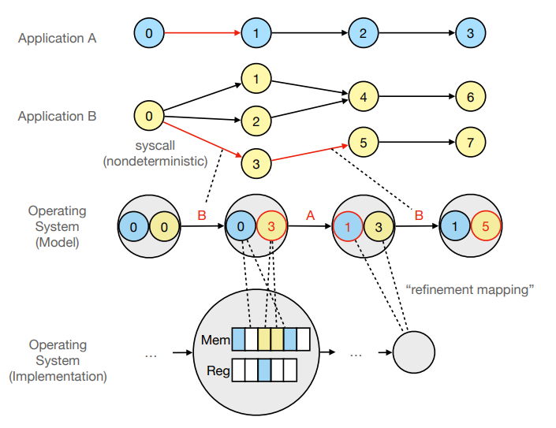

# 学术交流汇报

清华大学 计算机系 熊泽恩

2025 年清华大学人工智能学院大学生学术交流日

---

## 自我介绍

我是熊泽恩，清华大学计算机系大三本科生。

我对组件化操作系统、形式化验证，及其与人工智能相关交叉应用领域有浓厚兴趣。尤其是使用 LLM 辅助对 OS 进行形式化验证。

- 我掌握 C/C++、Python、Java、Rust 等多门编程语言，有十分**优秀的代码能力**。
- 我在 GitHub 上积极参与开源项目。
- 我曾在 2024 年 CCF 大学生计算机系统与程序设计竞赛中获得个人铜牌及团体总分第一名。

---

## 成果介绍 (1/2)

**1. Modeled OS 与教学辅助:**

- 学习并复现 Modeled OS 思想，将 OS 核心概念（如进程、中断）类比为状态机管理。
- 改进 MOSAIC (Modeled Operating System And Interactive Checker)：
   - 原论文：USENIX ATC'23 "The Hitchhiker’s Guide to Operating Systems"
   - 添加 `sys_exec()` 等系统调用。
   - 设计 `fork()`、`exec()` 及锁机制的教学示例。
   - 仓库链接: [leverimmy/mosaic](https://github.com/leverimmy/mosaic)
- 为清华大学 OS 课程讲义（第 1, 7, 12 讲）提供基于 Modeled OS 的理解和建议。

---

## 成果介绍 (1/2)

**1. Modeled OS 与教学辅助:**

- 学习并复现 Modeled OS 思想，将 OS 核心概念（如进程、中断）类比为状态机管理。
- 改进 MOSAIC (Modeled Operating System And Interactive Checker)：
   - 原论文：USENIX ATC'23 "The Hitchhiker’s Guide to Operating Systems"
   - 添加 `sys_exec()` 等系统调用。
   - 设计 `fork()`、`exec()` 及锁机制的教学示例。
   - 仓库链接: [leverimmy/mosaic](https://github.com/leverimmy/mosaic)
- 为清华大学 OS 课程讲义（第 1, 7, 12 讲）提供基于 Modeled OS 的理解和建议。

---

## 成果介绍 (2/2)

**2. 操作系统组件的形式化验证:**
- 学习 Kani 验证框架，并撰写学习笔记: [Kani 入门](https://leverimmy.top/2025/04/22/An-Introduction-to-Kani)
* 实践 Kani：
    * 验证基础算法（如冒泡排序）的正确性。
    * 使用 Kani 验证 ArceOS 的 `memory_addr` crate（最新版本）。
        * 分析并修复潜在对齐函数整数溢出问题 (改用 `wrapping_add()`)。
    * 成功通过 Kani 检测在 `memory_addr` 中植入的 bug。
* 探索在 ArceOS (Unikernel) 项目中集成 Kani，目标是验证内核组件的正确性。
    * 已实现使用 Kani 验证 ArceOS 上的用户程序。
* 调研模型检查在 OS 内核（尤其是组件化内核）层面的应用。

---

## 研究兴趣

- **高可信操作系统内核：**
   - 致力于提升操作系统内核的可靠性与安全性。
- **OS 组件的形式化验证：**
   - 应用模型检查工具 (如 Kani) 对关键内核组件（内存管理、调度、IPC等）进行形式化验证，确保其内存安全与行为正确性。
   - 探索组件化操作系统 (如 ArceOS) 中组件间交互的验证方法。
- **程序语言与软件工程:**
   - 如何利用程序语言特性和先进的软件工程方法（如模型检查）提升系统软件的质量。

---

## Q & A

**感谢聆听！**
